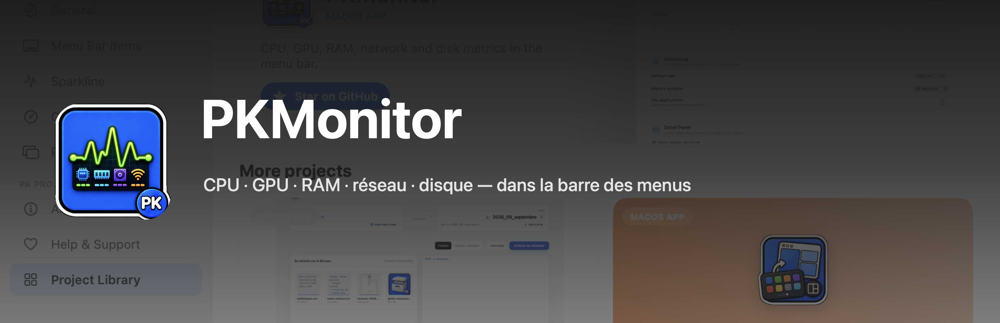
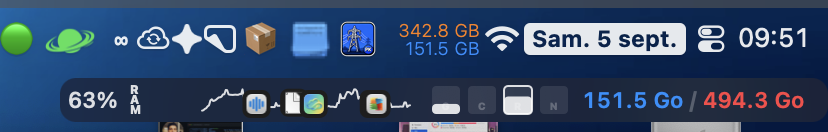
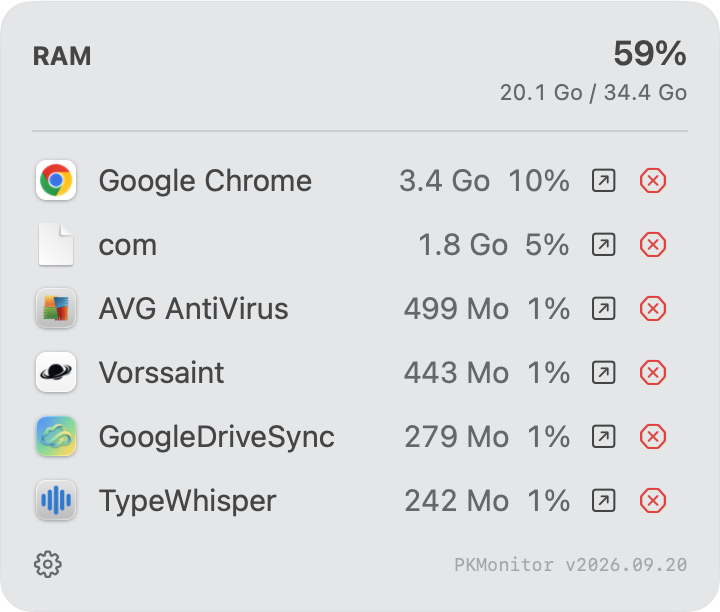

# PKMonitor



[🇫🇷 FR](README.md) · [🇬🇧 EN](README_en.md)

Moniteur système macOS natif et discret dans la barre des menus.

Version `2026.09.20` · [Roadmap](ROADMAP.md) · [Changelog](CHANGELOG.md)





## ✅ Fonctionnalités

- Sparkline temps réel avec icônes des applications dominantes
- CPU, GPU, RAM, réseau et espace disque
- Module disque en deux lignes : capacité totale rouge, espace libre bleu
- Segments activables individuellement, réordonnables et paramétrables
- Icônes des autres applications descendues dans la seconde barre (à la Bartender)
- Toggles d’affichage pour Sparkline, Gauges et Panel
- Panneau détaillé au survol avec arrêt de processus et bouton réglages
- Navigation Settings catégorisée, recherche et bibliothèque de projets
- Thème clair/sombre/système et lancement à la connexion

## 🧠 Utilisation

- Survoler l’élément de la barre des menus pour ouvrir le détail
- Cliquer sur un segment pour changer la métrique active
- Cliquer sur une icône descendue pour ouvrir son menu d’origine
- Clic droit pour ouvrir le menu et les réglages

## ⚙️ Réglages

La fenêtre Settings propose une sidebar par catégories, un champ de recherche, des toggles par module et des réglages détaillés pour l’affichage, les jauges, le panneau et la sparkline. Elle contient également les pages Help & Support et Project Library.

## 🧾 Commandes

```sh
./run.sh
swift build
swift run PKMonitor --self-test
```

## 📦 Build & Package

`run.sh` construit `dist/PKMonitor.app` en mode production avec les outils de ligne de commande Xcode.

## 🧪 Installation

Requiert macOS 13+ et les outils de ligne de commande Xcode. Exécuter `./run.sh`, puis conserver `dist/PKMonitor.app` ou le copier dans Applications.

## 📋 Historique

Voir le [CHANGELOG](CHANGELOG.md) pour l’historique complet.

## 🔗 Liens

- [GitHub](https://github.com/mondary/PKmonitor)
- [Bibliothèque des projets](https://github.com/mondary?tab=repositories)
- [Ko-fi](https://ko-fi.com/pouark)
- [Store copy](store/description-store.md)
