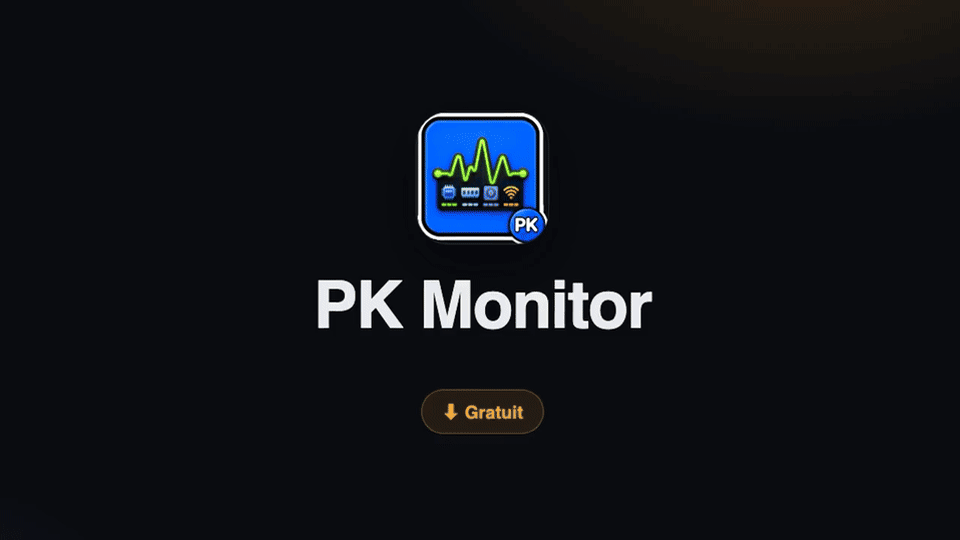

# PKMonitor


[🇫🇷 FR](README.md) · [🇬🇧 EN](README_en.md)

Moniteur système macOS natif et discret dans la barre des menus.

Version `2026.09.30` · [Roadmap](ROADMAP.md) · [Changelog](CHANGELOG.md)





## ✅ Fonctionnalités

- Sparkline temps réel avec icônes des applications dominantes
- Module disque paramétrable : total rouge et espace libre/disponible bleu, une ou deux lignes avec interlignage réglable, position et taille réglables
- CPU, GPU, RAM, réseau et espace disque, avec couleur de base et couleur critique réglables pour chaque jauge
- Icônes des autres applications descendues dans la seconde barre (à la Bartender)
- Toggles d’affichage pour Sparkline, Gauges et Panel
- Panneau détaillé au survol avec arrêt de processus et bouton réglages
- Navigation Settings catégorisée, recherche et bibliothèque de projets
- Conseiller IA en panneau latéral redimensionnable (droite, gauche ou bas) : tableau des processus gourmands, légitimité estimée, motifs des alertes et recommandations, via tout endpoint compatible OpenAI
- Thème clair/sombre/système et lancement à la connexion

## 🧠 Utilisation

- Survoler l’élément de la barre des menus pour ouvrir le détail
- Cliquer sur un segment pour changer la métrique active
- Cliquer sur une icône descendue pour ouvrir son menu d’origine
- Clic droit pour ouvrir le menu et les réglages
- Cliquer sur le bouton IA du panneau détaillé pour analyser ce qui consomme et recevoir des conseils

## ⚙️ Réglages

La fenêtre Settings propose un tableau de bord système en direct (matériel et métriques), une sidebar par catégories, un champ de recherche et un onglet par module : sparkline, jauges, disque, panneau, icônes de la menu bar, conseiller IA (endpoint compatible OpenAI, placement en panneau ou fenêtre, clé API dans le Keychain et analyse déclenchée volontairement). Elle contient également les pages Help & Support et Project Library.

## 🧾 Commandes

```sh
./run.sh
swift build
swift run PKMonitor --self-test
```

## 📦 Build & Package

`run.sh` construit `dist/PKMonitor.app` en mode production avec les outils de ligne de commande Xcode. Pour préparer l’archive distribuable, exécuter `./package_dmg.sh` : le DMG est créé dans `dist/PKMonitor.dmg` et peut être joint à une release GitHub.

## 🌐 Page promotionnelle

La page de présentation est disponible dans [`store/index.html`](store/index.html). Elle est autonome, responsive et prête à être hébergée telle quelle. Ses boutons de téléchargement ciblent `https://github.com/mondary/PKmonitor/releases/latest/download/PKMonitor.dmg`.

## 🧪 Installation

Requiert macOS 13+ et les outils de ligne de commande Xcode. Exécuter `./run.sh`, puis conserver `dist/PKMonitor.app` ou le copier dans Applications.

## 📋 Historique

Voir le [CHANGELOG](CHANGELOG.md) pour l’historique complet.

## 🔗 Liens

- [GitHub](https://github.com/mondary/PKmonitor)
- [Bibliothèque des projets](https://github.com/mondary?tab=repositories)
- [Ko-fi](https://ko-fi.com/pouark)
- [Store copy](store/description-store.md)
